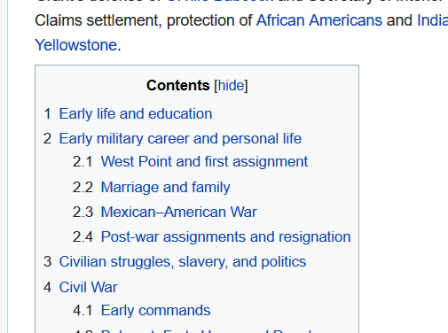

## Finishing Touches

Our mock wikipedia article is starting to look like something there's just a few finishing touches that we need before we can say its done.

If we look at our scaffold code, we can see that it is essentially one big wall of text and it is difficult to distinguish groups of elements apart from other similar elements, what we need is a way to divide one section of HTML from another. Lets add wrap each collection of `<h4><a>
` in a `
` element. We'll learn later that a `
` is used for many things, especially when it comes to layout, but as we already have a very 'blocky' webpage we wont notice any actual changes to our site (for now). One of the reasons we want to divide sections of our HTML is to make it more readable for ourselves and other developers who have to read our sometimes shocking code. 

Once you've added a `
` and closed it by moving the `
` to the end of the group of elements you want to close, we want to indent the HTML code that is inside this new div. Generally speaking, any elements that are "inside" of a container or parent element are indented, this makes it easier to read and understand the flow of the webpage. If your code isn't indented, the easy fix is to highlight the code to be indented and hit tab on your keyboard. It should have this same kind of syntax as below.

Even though our code hasn't changed from the inclusion of these \
 elements, having our code well structured and readable is preferable to an unorganized mess when it comes time to debug something you will thank past you if you took the time to indent properly.

Lastly, run your html code through the [html validator](https://validator.w3.org/) to iron out any syntax errors.
