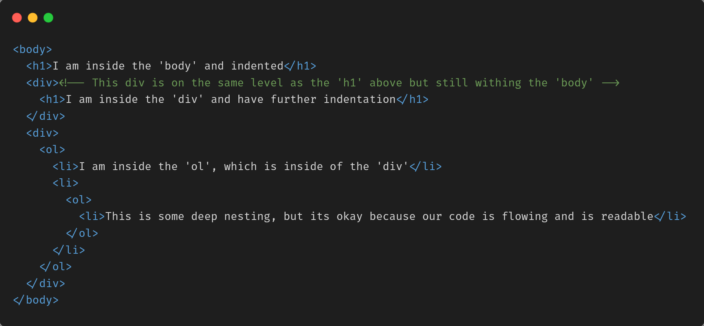

## First Layer of Content

Now that we have our starting tags, let's start adding some visual content for our user to see. Let's use a random wiki page and use that for inspiration. 

Go to the random section [here](https://en.wikipedia.org/wiki/Special:Random). If your random page is sparse you can randomize again. 

Lets add a heading and a paragraph inside our body and fill it in with the name and first paragraph of content from your random wiki page.

---

Next thing we want is that list of contents, if your page doesn't have a contents list just find another that does.

Our contents is an ordered list, some list items have their own lists within them

Underneath your first heading and paragraph start by creating an ordered list and populating that list with some of the contents from your wiki page. If you have nested lists (a list within a list, like in the image above) you will notice that in your Web Preview your nested list begins at 1 it doesn't do 2.1 or 2.2, this is fine and normal HTML behaviour.

---

Once you've added those, cross check with the solution to see if you have the same basic structure. The contents will be the different, but the basic structure should be the same.

